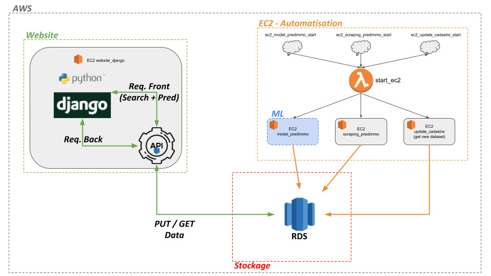
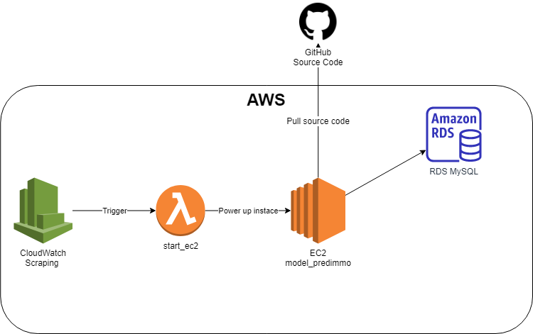
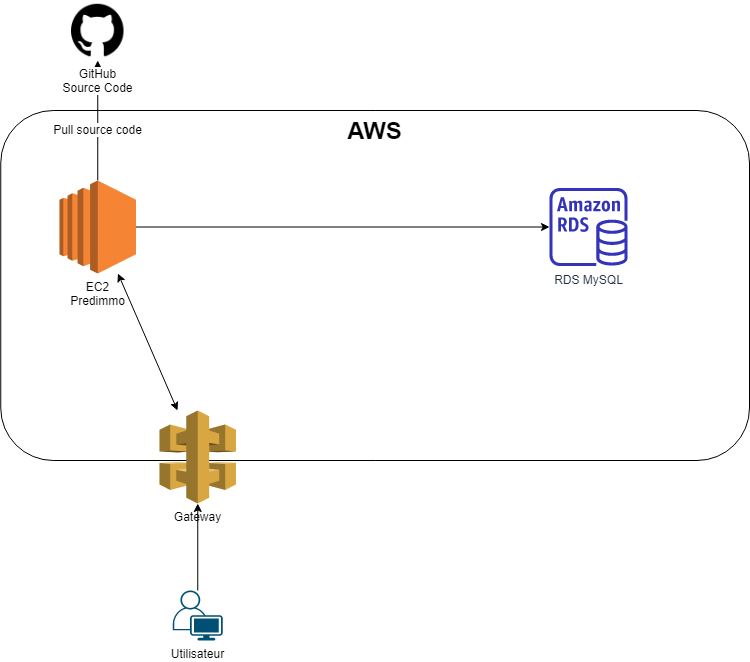
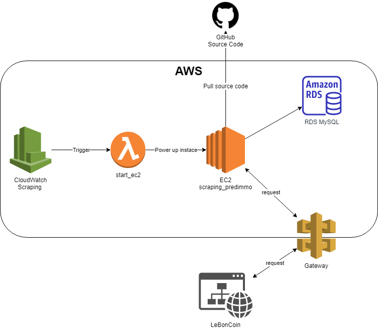

# Predimmo - Annual project ESGI 4IABD 

This proejct is a school project for ESGI (Paris).

The aim of this project, is to build an IA/BIG data solution. Here we made a website that will report prediction on real estate.

This project is fully hosted on Amazon Cloud Service, but you can run it locally. The AWS key found in the source code won't work anymore. You will need to provide your own keys.

## Architecture

This repo is only the Website and the source code to build the infrastructure on AWS. You will need to check our code on 3 other github repo to understand how each module running on EC2 instances work.

https://github.com/Uranium2/scraping_predimmo (Scrap Le Bon Coin to find real estates) 
https://github.com/Uranium2/update_cadastre (Will update the database with official sells)
https://github.com/Uranium2/modele_predimmo (Project that will create a Tensorflow model to train a predict values of real estate in the future)

Global workflow:

Model workflow:

Update data workflow:

Website worflow:

Scraping workflow:

## How to run

First you will need to update the AWS key in the file `src\upload_data\create_all_EC2.py` `src\upload_data\create_django_EC2.py`.

Then you will need to create an RDS mysql database with `src\upload_data\init_rds.py`, please change the login, password, and hostname. `src\web\django\mysqlcon.py` also in this file.

Once all your credential are filled and your RDS created. You can run  `src\upload_data\init_rds.py` to create the database and tables, then run  `src\upload_data\create_all_EC2.py` `src\upload_data\create_django_EC2.py` to create EC2 instances respecting the 3 git above and this repo (website/Django).

You will need to create a Lambda function to launch the EC2 instances. Create a Lambda function with this code inside : `src\upload_data\start_instance_lambda.py` 

Then create 3 CloudWatch to trigger your Lambda function. You can set the trigger of the CloudWatch once a day or week or month. The CloudWatch must send a Json the the Lambda Function. 

The Json must respect the tags given in the `src\upload_data\create_all_EC2.py` script. In our case we set the EC2 tag as the git project name.

json example:
 {"ec2_instance":"scraping_predimmo"}
 {"ec2_instance":"update_cadastre"}
 {"ec2_instance":"modele_predimmo"}

Once the web site running, you can launch `src\upload_data\open_web_site.py` to get the URL of the website.

Please note that AWS will change your DNS and IP at each reboot of EC2 Instance.

## Authors

TAVERNIER Antoine (https://github.com/Uranium2)

BERGERON Florian (https://github.com/FlorianBergeron)

COUSIN Cécile (https://github.com/cousincecile)

